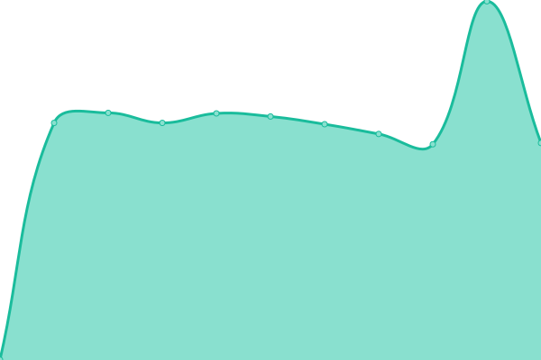

# [📈 Live Status](https://DevkraftTechnologies.github.io/upptime): <!--live status--> **🟧 Partial outage**

This repository contains the open-source uptime monitor and status page for [DevkraftTechnologies](https://DevkraftTechnologies.github.io/upptime), powered by [Upptime](https://github.com/upptime/upptime).

With [Upptime](https://upptime.js.org), you can get your own unlimited and free uptime monitor and status page, powered entirely by a GitHub repository. We use [Issues](https://github.com/DevkraftTechnologies/upptime/issues) as incident reports, [Actions](https://github.com/DevkraftTechnologies/upptime/actions) as uptime monitors, and [Pages](https://DevkraftTechnologies.github.io/upptime) for the status page.

<!--start: status pages-->
<!-- This summary is generated by Upptime (https://github.com/upptime/upptime) -->
<!-- Do not edit this manually, your changes will be overwritten -->
<!-- prettier-ignore -->
| URL | Status | History | Response Time | Uptime |
| --- | ------ | ------- | ------------- | ------ |
|  [Authorizer](https://auth-dev.devkraft.in/dashboard/) | 🟩 Up | [authorizer.yml](https://github.com/DevkraftTechnologies/upptime/commits/HEAD/history/authorizer.yml) | 

 988ms
     
 | 

<a href="https://status.devkraft.in/history/authorizer">100.00%</a>
    

|  [Semantic Search Prod](https://semantic-genai.indegene.com/api/v1/health) | 🟥 Down | [semantic-search-prod.yml](https://github.com/DevkraftTechnologies/upptime/commits/HEAD/history/semantic-search-prod.yml) | 

 10181ms
     
 | 

<a href="https://status.devkraft.in/history/semantic-search-prod">0.00%</a>
    

|  [Content Transcreation Prod](https://content-transcreation-genai.indegene.com/api/health) | 🟩 Up | [content-transcreation-prod.yml](https://github.com/DevkraftTechnologies/upptime/commits/HEAD/history/content-transcreation-prod.yml) | 

 196ms
     
 | 

<a href="https://status.devkraft.in/history/content-transcreation-prod">100.00%</a>
    

|  [Content AI Prod](https://content-ai-genai.indegene.com/api/health/) | 🟩 Up | [content-ai-prod.yml](https://github.com/DevkraftTechnologies/upptime/commits/HEAD/history/content-ai-prod.yml) | 

 160ms
     
 | 

<a href="https://status.devkraft.in/history/content-ai-prod">100.00%</a>
    

|  [Semantic Search QA](https://gist-qa.indegene.com/api/v1/health) | 🟩 Up | [semantic-search-qa.yml](https://github.com/DevkraftTechnologies/upptime/commits/HEAD/history/semantic-search-qa.yml) | 

 772ms
     
 | 

<a href="https://status.devkraft.in/history/semantic-search-qa">100.00%</a>
    

|  [Content Transcretion Dev](https://texttovid-dev.devkraft.in/api/health/) | 🟥 Down | [content-transcretion-dev.yml](https://github.com/DevkraftTechnologies/upptime/commits/HEAD/history/content-transcretion-dev.yml) | 

 773ms
     
 | 

<a href="https://status.devkraft.in/history/content-transcretion-dev">0.00%</a>
    

|  [Semantic Search Dev](https://semantic-dev.devkraft.in/api/v1/health) | 🟩 Up | [semantic-search-dev.yml](https://github.com/DevkraftTechnologies/upptime/commits/HEAD/history/semantic-search-dev.yml) | 

 961ms
     
 | 

<a href="https://status.devkraft.in/history/semantic-search-dev">97.69%</a>
    

|  [Content AI Dev](https://content-ai-dev.devkraft.in/api/health/) | 🟩 Up | [content-ai-dev.yml](https://github.com/DevkraftTechnologies/upptime/commits/HEAD/history/content-ai-dev.yml) | 

 751ms
     
 | 

<a href="https://status.devkraft.in/history/content-ai-dev">100.00%</a>
    

|  [Dekoder Prod](https://www.dekoder.com/) | 🟥 Down | [dekoder-prod.yml](https://github.com/DevkraftTechnologies/upptime/commits/HEAD/history/dekoder-prod.yml) | 

 209ms
     
 | 

<a href="https://status.devkraft.in/history/dekoder-prod">100.00%</a>
    

|  [Dekoder CMS](https://cms-p4r5o6d.dekoder.com/) | 🟥 Down | [dekoder-cms.yml](https://github.com/DevkraftTechnologies/upptime/commits/HEAD/history/dekoder-cms.yml) | 

 314ms
     
 | 

<a href="https://status.devkraft.in/history/dekoder-cms">20.30%</a>
    

|  [Dekoder API](https://p4r5o6d.dekoder.com) | 🟥 Down | [dekoder-api.yml](https://github.com/DevkraftTechnologies/upptime/commits/HEAD/history/dekoder-api.yml) | 

 278ms
     
 | 

<a href="https://status.devkraft.in/history/dekoder-api">0.00%</a>
    

|  [BI-Monitoring-Indegene](https://bi-monitor.indegene.com/api/health) | 🟩 Up | [bi-monitoring-indegene.yml](https://github.com/DevkraftTechnologies/upptime/commits/HEAD/history/bi-monitoring-indegene.yml) | 

 421ms
     
 | 

<a href="https://status.devkraft.in/history/bi-monitoring-indegene">100.00%</a>
    

|  [DevOps2-Stack](https://devops2.whiteswansec.io/) | 🟥 Down | [dev-ops2-stack.yml](https://github.com/DevkraftTechnologies/upptime/commits/HEAD/history/dev-ops2-stack.yml) | 

 0ms
     
 | 

<a href="https://status.devkraft.in/history/dev-ops2-stack">0.00%</a>
    

|  [Dekoder-GPU-Translation-VM](http://13.203.98.187/) | 🟩 Up | [dekoder-gpu-translation-vm.yml](https://github.com/DevkraftTechnologies/upptime/commits/HEAD/history/dekoder-gpu-translation-vm.yml) | 

 464ms
     
 | 

<a href="https://status.devkraft.in/history/dekoder-gpu-translation-vm">100.00%</a>
    

|  [Dekoder-NonGPU-Translation-VM](http://13.204.205.142/) | 🟥 Down | [dekoder-non-gpu-translation-vm.yml](https://github.com/DevkraftTechnologies/upptime/commits/HEAD/history/dekoder-non-gpu-translation-vm.yml) | 

 0ms
     
 | 

<a href="https://status.devkraft.in/history/dekoder-non-gpu-translation-vm">0.00%</a>
    

|  [dekoder-translation-gpu-clone-vm](http://13.204.242.241/) | 🟥 Down | [dekoder-translation-gpu-clone-vm.yml](https://github.com/DevkraftTechnologies/upptime/commits/HEAD/history/dekoder-translation-gpu-clone-vm.yml) | 

 8232ms
     
 | 

<a href="https://status.devkraft.in/history/dekoder-translation-gpu-clone-vm">1.87%</a>
    

|  [translation-amar-new-vm-1](http://13.234.81.201/) | 🟥 Down | [translation-amar-new-vm-1.yml](https://github.com/DevkraftTechnologies/upptime/commits/HEAD/history/translation-amar-new-vm-1.yml) | 

 0ms
     
 | 

<a href="https://status.devkraft.in/history/translation-amar-new-vm-1">0.01%</a>
    

|  [translation-amar-new-vm-2](http://13.205.31.184/) | 🟥 Down | [translation-amar-new-vm-2.yml](https://github.com/DevkraftTechnologies/upptime/commits/HEAD/history/translation-amar-new-vm-2.yml) | 

 0ms
     
 | 

<a href="https://status.devkraft.in/history/translation-amar-new-vm-2">0.01%</a>
    

|  [winodow-server-vm](http://35.154.64.113/) | 🟥 Down | [winodow-server-vm.yml](https://github.com/DevkraftTechnologies/upptime/commits/HEAD/history/winodow-server-vm.yml) | 

 0ms
     
 | 

<a href="https://status.devkraft.in/history/winodow-server-vm">0.01%</a>
    

|  [winodow-server-vm2](http://13.234.197.189/) | 🟥 Down | [winodow-server-vm2.yml](https://github.com/DevkraftTechnologies/upptime/commits/HEAD/history/winodow-server-vm2.yml) | 

 0ms
     
 | 

<a href="https://status.devkraft.in/history/winodow-server-vm2">0.01%</a>
    

<!--end: status pages-->

[**Visit our status website →**](https://DevkraftTechnologies.github.io/upptime)

## 📄 License

- Powered by: [Upptime](https://github.com/upptime/upptime)
- Code: [MIT](./LICENSE) © [DevkraftTechnologies](https://DevkraftTechnologies.github.io/upptime)
- Data in the `./history` directory: [Open Database License](https://opendatacommons.org/licenses/odbl/1-0/)
