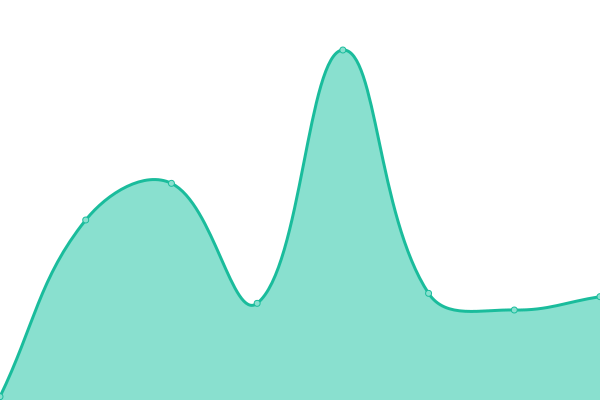
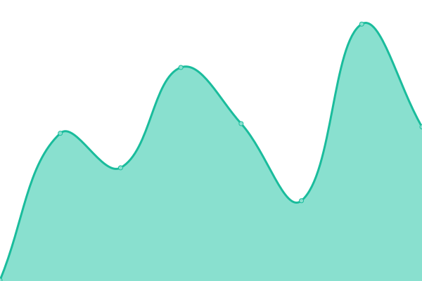
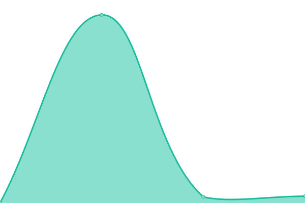

# [📈 Live Status](https://DevkraftTechnologies.github.io/upptime): <!--live status--> **🟧 Partial outage**

This repository contains the open-source uptime monitor and status page for [DevkraftTechnologies](https://DevkraftTechnologies.github.io/upptime), powered by [Upptime](https://github.com/upptime/upptime).

With [Upptime](https://upptime.js.org), you can get your own unlimited and free uptime monitor and status page, powered entirely by a GitHub repository. We use [Issues](https://github.com/DevkraftTechnologies/upptime/issues) as incident reports, [Actions](https://github.com/DevkraftTechnologies/upptime/actions) as uptime monitors, and [Pages](https://DevkraftTechnologies.github.io/upptime) for the status page.

<!--start: status pages-->
<!-- This summary is generated by Upptime (https://github.com/upptime/upptime) -->
<!-- Do not edit this manually, your changes will be overwritten -->
<!-- prettier-ignore -->
| URL | Status | History | Response Time | Uptime |
| --- | ------ | ------- | ------------- | ------ |
|  [Dekoder Prod](https://www.dekoder.com/) | 🟥 Down | [dekoder-prod.yml](https://github.com/DevkraftTechnologies/upptime/commits/HEAD/history/dekoder-prod.yml) | 

 188ms
     
 | 

<a href="https://status.devkraft.in/history/dekoder-prod">100.00%</a>
    

|  [Dekoder CMS](https://cms-p4r5o6d.dekoder.com/) | 🟥 Down | [dekoder-cms.yml](https://github.com/DevkraftTechnologies/upptime/commits/HEAD/history/dekoder-cms.yml) | 

 189ms
     
 | 

<a href="https://status.devkraft.in/history/dekoder-cms">100.00%</a>
    

|  [Dekoder API](https://p4r5o6d.dekoder.com) | 🟥 Down | [dekoder-api.yml](https://github.com/DevkraftTechnologies/upptime/commits/HEAD/history/dekoder-api.yml) | 

 150ms
     
 | 

<a href="https://status.devkraft.in/history/dekoder-api">0.00%</a>
    

|  [Dekoder-GPU-Translation-VM](http://13.203.98.187/) | 🟩 Up | [dekoder-gpu-translation-vm.yml](https://github.com/DevkraftTechnologies/upptime/commits/HEAD/history/dekoder-gpu-translation-vm.yml) | 

 434ms
     
 | 

<a href="https://status.devkraft.in/history/dekoder-gpu-translation-vm">99.82%</a>
    

|  [Dekoder-NonGPU-Translation-VM](http://13.204.205.142/) | 🟩 Up | [dekoder-non-gpu-translation-vm.yml](https://github.com/DevkraftTechnologies/upptime/commits/HEAD/history/dekoder-non-gpu-translation-vm.yml) | 

 9045ms
     
 | 

<a href="https://status.devkraft.in/history/dekoder-non-gpu-translation-vm">0.02%</a>
    

|  [dekoder-translation-gpu-clone-vm](http://13.204.242.241/) | 🟩 Up | [dekoder-translation-gpu-clone-vm.yml](https://github.com/DevkraftTechnologies/upptime/commits/HEAD/history/dekoder-translation-gpu-clone-vm.yml) | 

 431ms
     
 | 

<a href="https://status.devkraft.in/history/dekoder-translation-gpu-clone-vm">100.00%</a>
    

|  [translation-amar-new-vm-1](http://13.234.81.201/) | 🟥 Down | [translation-amar-new-vm-1.yml](https://github.com/DevkraftTechnologies/upptime/commits/HEAD/history/translation-amar-new-vm-1.yml) | 

 0ms
     
 | 

<a href="https://status.devkraft.in/history/translation-amar-new-vm-1">0.00%</a>
    

|  [translation-amar-new-vm-2](http://13.205.31.184/) | 🟥 Down | [translation-amar-new-vm-2.yml](https://github.com/DevkraftTechnologies/upptime/commits/HEAD/history/translation-amar-new-vm-2.yml) | 

 0ms
     
 | 

<a href="https://status.devkraft.in/history/translation-amar-new-vm-2">0.00%</a>
    

|  [winodow-server-vm](http://35.154.64.113/) | 🟥 Down | [winodow-server-vm.yml](https://github.com/DevkraftTechnologies/upptime/commits/HEAD/history/winodow-server-vm.yml) | 

 0ms
     
 | 

<a href="https://status.devkraft.in/history/winodow-server-vm">0.00%</a>
    

|  [winodow-server-vm2](http://13.234.197.189/) | 🟥 Down | [winodow-server-vm2.yml](https://github.com/DevkraftTechnologies/upptime/commits/HEAD/history/winodow-server-vm2.yml) | 

 0ms
     
 | 

<a href="https://status.devkraft.in/history/winodow-server-vm2">0.00%</a>
    

|  [GoodMeetings.AI Main Website](https://goodmeetings.ai/) | 🟥 Down | [good-meetings-ai-main-website.yml](https://github.com/DevkraftTechnologies/upptime/commits/HEAD/history/good-meetings-ai-main-website.yml) | 

 0ms
     
 | 

<a href="https://status.devkraft.in/history/good-meetings-ai-main-website">0.00%</a>
    

|  [app.goodMeetings.ai Website](https://app.goodmeetings.ai/) | 🟩 Up | [app-good-meetings-ai-website.yml](https://github.com/DevkraftTechnologies/upptime/commits/HEAD/history/app-good-meetings-ai-website.yml) | 

 687ms
     
 | 

<a href="https://status.devkraft.in/history/app-good-meetings-ai-website">100.00%</a>
    

<!--end: status pages-->

[**Visit our status website →**](https://DevkraftTechnologies.github.io/upptime)

## 📄 License

- Powered by: [Upptime](https://github.com/upptime/upptime)
- Code: [MIT](./LICENSE) © [DevkraftTechnologies](https://DevkraftTechnologies.github.io/upptime)
- Data in the `./history` directory: [Open Database License](https://opendatacommons.org/licenses/odbl/1-0/)
